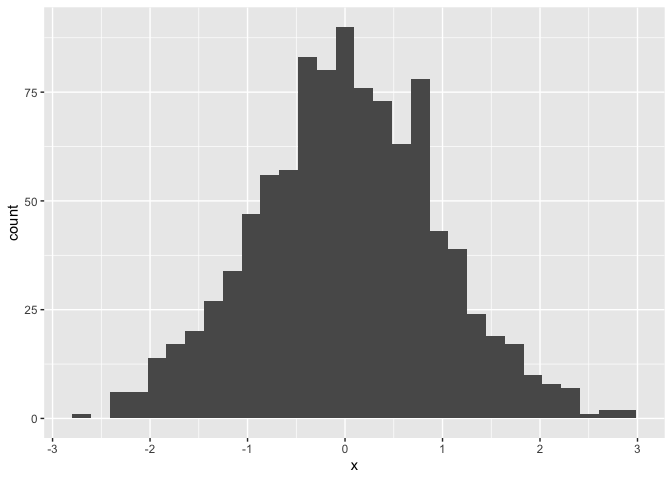
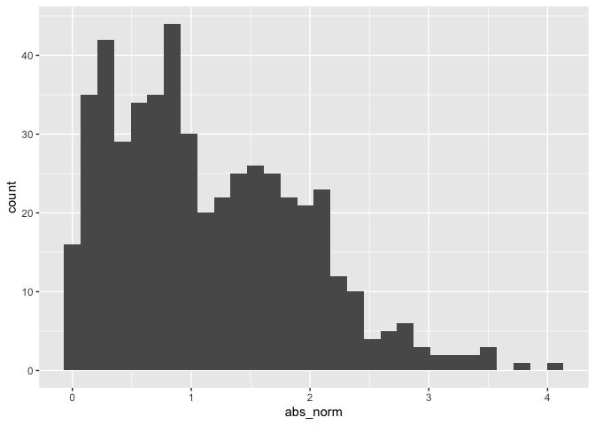

Simple document
================

``` r
library(tidyverse)
```

    ## ── Attaching packages ─────────────────────────────────────── tidyverse 1.3.2 ──
    ## ✔ ggplot2 3.3.6      ✔ purrr   0.3.4 
    ## ✔ tibble  3.1.8      ✔ dplyr   1.0.10
    ## ✔ tidyr   1.2.0      ✔ stringr 1.4.1 
    ## ✔ readr   2.1.2      ✔ forcats 0.5.2 
    ## ── Conflicts ────────────────────────────────────────── tidyverse_conflicts() ──
    ## ✖ dplyr::filter() masks stats::filter()
    ## ✖ dplyr::lag()    masks stats::lag()

``` r
library(tibble)
```

I’m an R Markdown document!

# Section 1

Here’s a **code chunk** that samples from a *normal distribution*:

``` r
samp = rnorm(100)
length(samp)
```

    ## [1] 100

# Section 2

I can take the mean of the sample, too! The mean is -0.09.

# Section 3

This is going to make a plot.First, I generate a dataframe, then I use
`ggplot` to generate a histogram.

    ## `stat_bin()` using `bins = 30`. Pick better value with `binwidth`.

<!-- -->

\#Section 4

## resolution to learning assessment

``` r
Fendi = tibble (
      norm = rnorm(500, mean = 1),
      logical = norm >0,
      abs_norm = abs(norm)
)

ggplot(Fendi, aes(x = abs_norm)) + geom_histogram()
```

    ## `stat_bin()` using `bins = 30`. Pick better value with `binwidth`.

<!-- -->
